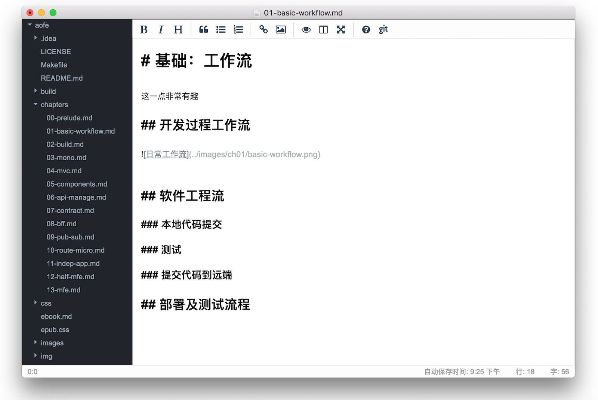

# Phodit

> a personal markdown editor with electron for Phodal

  

 

Screenshots

Features
---

 - support for git markdown project
 - Terminal integration
 - tree navigator
 - fullscreen support
 - preview markdown
 - code highlight support
 - search by: Google, Baidu, WIKI, Zhihu, Github
 - **Phodal's blog relative search**
 
Goal
---

 - 支持基于 Git 和 Markdown 的写作模式
 - 支持微信公众号编辑器
 - 各式语法高亮
 - 导出 Word 和 PDF（考虑 Pandoc）
 - Markdown Slide 预览及更高级效果
 - 一键发布到各个平台的自动化脚本

### 技术细节

 - 国际化支持
 - WebComponents 内建
 - 微前端架构 

License
---

© 2018 A [Phodal Huang](https://www.phodal.com)'s [Idea](http://github.com/phodal/ideas).  This code is distributed under the MIT license. See `LICENSE` in this directory.
